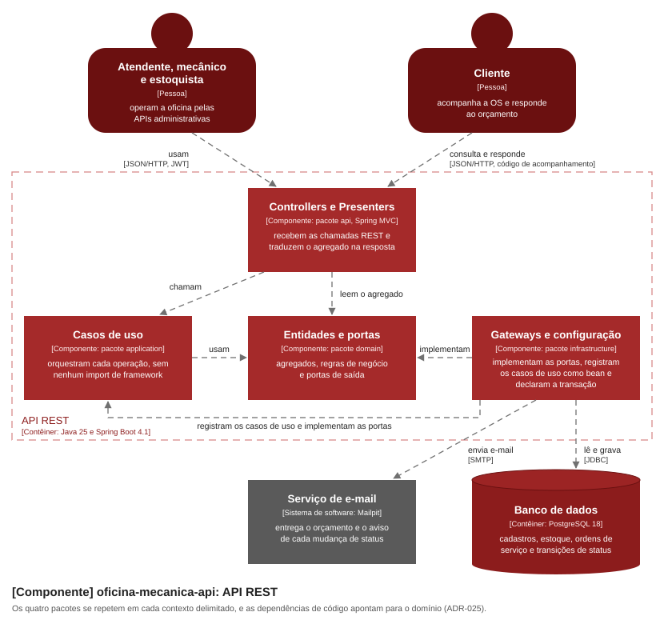
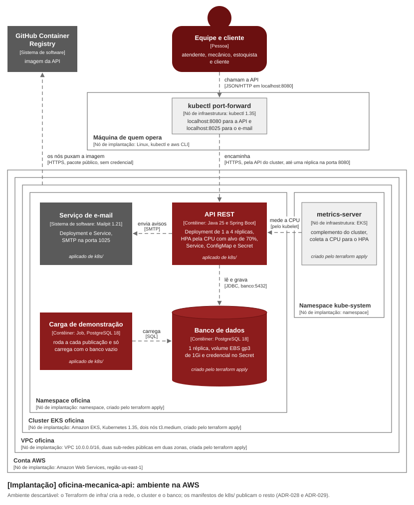
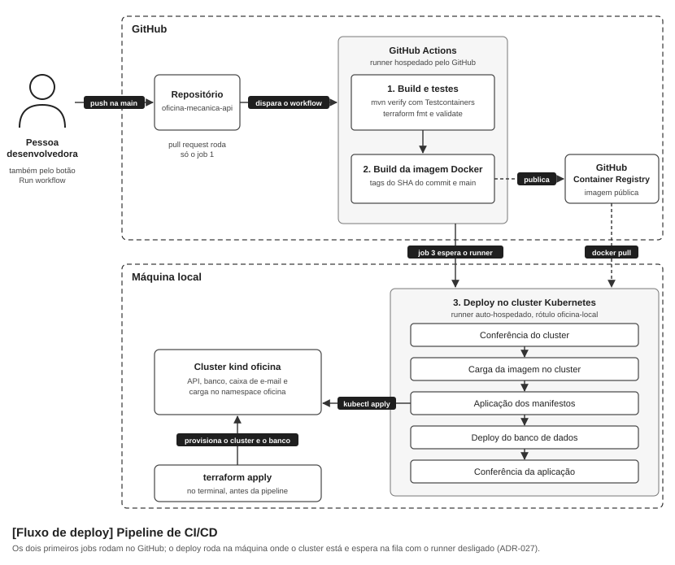

# oficina-mecanica-api

API de gestão para oficina mecânica de médio porte: ordem de serviço, orçamento com aprovação do cliente, controle de estoque e acompanhamento do atendimento. Back-end em **Clean Architecture**, com o domínio modelado por DDD.

Tech Challenge da pós-graduação em Arquitetura de Software (FIAP). A **Fase 1** entregou o domínio, a API e o ambiente local. A **Fase 2** evolui esta mesma aplicação: a arquitetura passa a ser Clean Architecture com a regra de dependência provada no build (ADR-025), e o atendimento ganha o pedido inicial do cliente na abertura, a fila de atendimento com exclusão lógica das encerradas, a notificação externa de aprovação do orçamento e o aviso por e-mail a cada mudança de status (ADR-026). E a aplicação passa a rodar em Kubernetes na AWS, num cluster EKS que o Terraform provisiona junto com o banco (ADR-028), publicada por manifestos e por uma pipeline de CI/CD que também provisiona e destrói o ambiente, com escala automática pela CPU (ADR-029).

## Objetivos

A oficina atende, diagnostica, executa e entrega usando anotação manual e planilha, e é dessa forma de trabalho que nascem os cinco problemas que este sistema existe para resolver: erro na priorização dos atendimentos, falha no controle de peças e insumos, dificuldade de acompanhar o status dos serviços, perda do histórico de clientes e veículos, e ineficiência no fluxo de orçamentos e autorizações.

A primeira versão substituiu a planilha pelo registro que o próprio fluxo de trabalho produz: cada mudança de status é gravada com data e hora pela ação que a causou, o orçamento nasce dos itens lançados e vai ao cliente para aprovação, a peça é separada para a OS na aprovação do orçamento e só sai do saldo quando o Mecânico a retira, e o cliente acompanha a própria Ordem de Serviço sem depender de telefonema.

**O objetivo desta fase é evoluir essa aplicação para garantir qualidade, resiliência e escalabilidade.** A mudança de fundo é arquitetural, e ela deixa de ser promessa de documento porque o build prova: as dependências apontam para o centro e o framework não entra no anel dos casos de uso. Sobre essa base, o atendimento ganha o que o fluxo pedia e não tinha: o cliente pede serviço já na abertura, a fila mostra primeiro o que está na bancada e esconde o que já saiu, a resposta ao orçamento chega de fora por notificação, e cada mudança de status é avisada ao cliente por e-mail.

A outra metade do objetivo é o ambiente. Ele deixa de depender de alguém lembrar a sequência de comandos: o cluster e o banco nascem de código, pela pipeline ou pelo terminal, e são destruídos ao fim de cada uso; cada push na `main` é construído e testado pela pipeline e, com o cluster de pé, publicado nele; a publicação troca as réplicas sem perder chamada, e a aplicação ganha réplicas quando a carga sobe e as devolve quando ela cai.

O recorte segue sendo de MVP: back-end, com gestão de ordens de serviço, clientes e peças, e a única tela é a página pública de resposta ao orçamento.

## Documentação DDD

Event Storming dos dois fluxos, Domain Storytelling (AS-IS e TO-BE), Context Map com os subdomínios, modelo de domínio, Linguagem Ubíqua e o C4 nos níveis de Contexto e de Contêiner.

**Link da documentação:** https://miro.com/app/board/uXjVHuneCTk=/?share_link_id=665030044859

## O que o sistema faz

- **Ordem de Serviço** com máquina de estados (Recebida, Em diagnóstico, Aguardando aprovação, Em execução, Finalizada, Entregue, mais Cancelada, o sétimo status decidido no ADR-008), com mudança automática de status conforme as ações no sistema.
- **Orçamento** gerado automaticamente a partir dos itens de serviço e de peça, enviado ao cliente por e-mail, e respondido pela **notificação externa de aprovação ou de recusa**: duas rotas públicas que quem está fora do sistema chama portando o código de acompanhamento, sem exigir login do cliente. O e-mail do orçamento leva o link de uma página pública de resposta, com os botões de aprovar e de recusar que chamam essas rotas.
- **CRUDs** de clientes, veículos, serviços e peças, este último com controle de estoque (reserva, baixa, entrada e consulta de peças abaixo do estoque mínimo).
- **Atualização de status por e-mail:** o e-mail do orçamento leva o cliente à página de resposta, e o clique em aprovar ou em recusar muda o status da OS pela notificação externa. **A leitura adotada do requisito é esta**, e ela está fundamentada no ADR-026. Como complemento, toda transição de status envia ao cliente um e-mail com o status novo e o endereço de acompanhamento, que é a mesma página. O envio é atômico com a transição: se o e-mail não sai, a transição não acontece, porque falha visível é preferível a notificação perdida em silêncio. A transição que gera orçamento é notificada pelo e-mail do orçamento, que já carrega o status novo e o mesmo endereço, então cada transição produz exatamente um e-mail.
- **Tempo médio de execução** dos serviços, calculado a partir dos timestamps das transições de status.
- **Autenticação JWT** nas APIs administrativas e validação de dados sensíveis (documento e placa) como regra de domínio.

### Status da OS: o nome no enunciado da fase e o identificador da API

O enunciado da fase nomeia os status em português corrente, e a API responde identificadores. A tabela liga um ao outro, para que a palavra do enunciado leve ao campo certo; a escolha de manter os identificadores está no ADR-026.

| Nome no enunciado da fase | Identificador na API |
|---|---|
| Recebida | `RECEBIDA` |
| Diagnóstico | `EM_DIAGNOSTICO` |
| Aguardando Aprovação | `AGUARDANDO_APROVACAO` |
| Execução | `EM_EXECUCAO` |
| Finalizada | `FINALIZADA` |
| Entregue | `ENTREGUE` |
| Cancelada (sétimo status, ADR-008) | `CANCELADA` |

A **listagem sem filtro** devolve a fila de atendimento nesta ordem de prioridade: `EM_EXECUCAO`, `AGUARDANDO_APROVACAO`, `EM_DIAGNOSTICO`, `RECEBIDA`, e dentro do mesmo status da mais antiga para a mais nova. As OSs `FINALIZADA`, `ENTREGUE` e `CANCELADA` ficam fora dela. **A exclusão é lógica:** o registro continua respondendo pela consulta por identificador e reaparece quando o filtro `?status=` o pede.

## Desenho da arquitetura

O ambiente desenhado roda na AWS e é descartável: ele é criado e destruído a cada uso, e não descreve um ambiente de produção (ADR-028). Os dois primeiros desenhos seguem o C4 Model e continuam o C4 de Contexto e de Contêiner da documentação DDD: o diagrama de componentes abre o contêiner da API REST, e o diagrama de implantação mostra onde cada contêiner roda.

### Componentes da aplicação



Os pacotes de cada contexto delimitado estão em "Estrutura do projeto", e a regra de dependência, com o teste que a prova, no ADR-025.

### Infraestrutura provisionada



Cada caixa diz de onde vem: o `terraform apply` de [`infra/`](infra/) cria a rede, o cluster, o `metrics-server`, o namespace e o banco, e os manifestos de [`k8s/`](k8s/) publicam o resto. Os comandos estão em "Provisionamento com Terraform" e "Deploy em Kubernetes".

### Fluxo de deploy



Cada passo, com o nome que aparece no log, está em "Pipeline de CI/CD".

## Pré-requisitos

| Caminho | Ferramenta | Versão testada |
|---|---|---|
| Execução local com Docker Compose | Docker Engine | 29.8.2 |
| Execução local com Docker Compose | Docker Compose | v5.5.1 |
| Execução local sem Docker e testes | Java | 25.0.4, fixada em [`.sdkmanrc`](.sdkmanrc) |
| Execução local sem Docker e testes | Maven | 3.9.9 |
| Provisionamento com Terraform e deploy em Kubernetes | conta AWS e `aws` CLI | 2.37.9 |
| Provisionamento com Terraform e deploy em Kubernetes | Terraform | 1.16.1 |
| Provisionamento com Terraform e deploy em Kubernetes | `kubectl` | v1.35.9 |

## Execução local com Docker Compose

Pré-requisitos: Docker e Docker Compose, com as portas **5432**, **8080**, **1025** e **8025** livres. Se houver um PostgreSQL ou outra aplicação ocupando alguma delas na máquina, o `docker compose up` falha com `port is already allocated`: pare o serviço local, ou ajuste o mapeamento no `docker-compose.yml`.

```bash
docker compose up --build
```

O ambiente sobe **populado**: o Flyway cria o schema e, logo depois, o serviço `seed` carrega os dados de demonstração, então não é preciso cadastrar nada para testar.

**Confira que a carga terminou bem.** O `docker compose up` não propaga a falha de um contêiner de tarefa única, então ele pode devolver sucesso com o banco vazio. O comando acima segura o terminal enquanto o ambiente estiver de pé, então **abra outro terminal** para conferir:

```bash
docker compose ps -a    # seed deve estar Exited (0); qualquer outro código é falha
docker compose logs seed
```

O `seed` é um contêiner de tarefa única: espera o schema existir, carrega uma vez e termina, então vê-lo sair da lista de contêineres em execução é o esperado. Os dados de demonstração e o script que os carrega vivem em [`seed/`](seed/), e não em `db/migration`, pelo motivo registrado no ADR-015.

O que já vem carregado: **uma Ordem de Serviço em cada um dos sete status**, com o histórico completo de transições (insumo do tempo médio de execução), clientes PF e PJ, veículos nos dois formatos de placa, catálogo de serviços e peças com saldo e estoque mínimo.

- Usuário administrativo de demonstração: login `admin`, senha `admin123`, apenas para o ambiente local de avaliação.
- Segredo de assinatura do JWT: fixado no `application.yml` e no `docker-compose.yml`, **apenas para o ambiente local de avaliação**, para que o ambiente suba sem configuração externa. Como ele está versionado, qualquer pessoa com o repositório emite um token válido, então **este valor não serve a nenhum ambiente real**; lá ele entra pela variável `JWT_SEGREDO`.
- As Ordens de Serviço em estado **vivo** (recebida, em diagnóstico, aguardando aprovação, em execução) têm datas **relativas ao momento da carga**, de propósito: elas mantêm a ordem aguardando aprovação dentro da janela em que o lembrete é devido, em vez de o ambiente envelhecer junto com o arquivo. O disparo automático do lembrete **não faz parte do MVP** (ADR-008); o que o ambiente entrega é o estado que o torna devido. As **encerradas** mantêm data absoluta no passado, porque são histórico. As duas concluídas alimentam o tempo médio de execução; a cancelada não, porque nunca entrou em execução.
- A carga acontece na **primeira subida**. Como o banco usa volume nomeado, subir de novo não recarrega, e o serviço `seed` detecta que já há dados e não faz nada. Para recomeçar do zero, `docker compose down -v && docker compose up --build`.

- API: `http://localhost:8080/api/v1`
- Banco: PostgreSQL 18 em `localhost:5432` (base, usuário e senha `oficina`, `oficina` e `oficina_local`, apenas para o ambiente local)
- Caixa de e-mail do ambiente: `http://localhost:8025`. É onde chegam o orçamento e o aviso de cada mudança de status, sem provedor externo e sem credencial (ADR-007).

## Collection das APIs: Swagger e contrato OpenAPI

Com o ambiente de pé:

- Interface: http://localhost:8080/swagger-ui.html
- Especificação: http://localhost:8080/v3/api-docs
- Contrato fonte versionado: [`openapi.yaml`](openapi.yaml)

As duas primeiras servem a especificação **gerada a partir do código**, e ela difere do contrato versionado em conteúdo, não em quantidade de rotas: a especificação gerada traz o título e a área de negócio de cada operação, mas **nenhuma delas tem descrição longa**; **não publica as respostas de erro nem o schema `Erro`**; não carrega as restrições de valor monetário (mínimo, teto e moeda única); **não traz o `info.description`**, que é onde moram as convenções de autorização e de erro de protocolo; expõe uma propriedade de validação de campo cruzado que o contrato não tem; e sai em OpenAPI 3.1.0 contra 3.0.3 do arquivo versionado. **O `openapi.yaml` é a fonte de verdade do contrato completo**, e é ele que deve ser lido para conhecer o contrato; o Swagger UI serve para experimentar as chamadas.

A documentação, o login, as três rotas de acompanhamento do cliente, a página de resposta ao orçamento (`/acompanhamento.html`) e as duas sondas de saúde (`/actuator/health/liveness` e `/actuator/health/readiness`) são públicos: as de acompanhamento pelo ADR-007, a página pelo ADR-026, e as sondas porque o Kubernetes as consulta sem credencial. As sondas leem só o estado de disponibilidade da própria aplicação, sem consultar banco nem e-mail, então uma chamada anônima não gera trabalho fora dela. A raiz `/actuator/health` exige JWT, e nenhum outro endpoint do actuator é exposto. Todas as demais rotas **sob `/api/v1`** exigem JWT.

Para experimentar a superfície do cliente sem autenticar, use o código de acompanhamento da Ordem de Serviço que a carga deixa aguardando aprovação, `ACMP-e5a312adaec084e9ea783e0ff3f142a6`, ou abra a página de resposta dela em http://localhost:8080/acompanhamento.html?codigo=ACMP-e5a312adaec084e9ea783e0ff3f142a6.

## Autenticação

`POST /api/v1/auth/login` é público e devolve o token; as demais rotas administrativas exigem o cabeçalho `Authorization: Bearer <token>` e respondem `401` com corpo JSON `{"codigo": "NAO_AUTORIZADO", "mensagem": "..."}` quando o token está ausente, é inválido ou expirou.

```bash
TOKEN=$(curl -s -X POST http://localhost:8080/api/v1/auth/login \
  -H 'Content-Type: application/json' \
  -d '{"login":"admin","senha":"admin123"}' | sed -E 's/.*"token":"([^"]+)".*/\1/')

curl -s -H "Authorization: Bearer $TOKEN" http://localhost:8080/api/v1/clientes
```

O token é HS256, com validade padrão de 60 minutos, assinado com o segredo de `oficina.jwt.segredo`. O segredo precisa ter no mínimo 32 bytes: abaixo disso a aplicação **não sobe**, e falha com a contagem de bytes na mensagem, em vez de quebrar no primeiro login.

## Execução local sem Docker

Requer **Java 25** e Maven. A versão exata do JDK está fixada em [`.sdkmanrc`](.sdkmanrc); com SDKMAN, basta `sdk env` na raiz do projeto.

```bash
docker compose up banco email -d    # sobe o PostgreSQL e a caixa de e-mail
TZ=UTC mvn spring-boot:run          # cria o schema pelo Flyway
```

**O `TZ=UTC` não é enfeite.** As colunas de data e hora são `TIMESTAMP` sem fuso, e o driver JDBC impõe o fuso da JVM à sessão do banco, inclusive ao `NOW()` avaliado no servidor. Os dados de demonstração são carregados por um contêiner em UTC; a aplicação rodando fora do Docker herdaria o fuso da máquina, e as duas escritas ficariam em relógios diferentes. Em fuso a oeste de Brasília isso chega a gravar uma transição **antes** da transição inicial da própria Ordem de Serviço, o que corrompe o tempo médio de execução (ADR-008). Pelo `docker compose up`, todos os contêineres estão em UTC e o problema não existe.

Este caminho sobe o banco **vazio**, porque o serviço `seed` não entra nele. O `mvn spring-boot:run` também segura o terminal, então, com a aplicação de pé e o schema criado, carregue os dados de demonstração **em outro terminal**:

```bash
docker compose run --rm --no-deps seed
```

## Provisionamento com Terraform

**Quem não tem conta AWS roda a aplicação pela [execução local com Docker Compose](#execução-local-com-docker-compose) e vê o cluster no vídeo.** Esta seção reproduz o ambiente na nuvem, e ele custa: cerca de US$ 0,20 por hora com o cluster de pé, e de 10 a 15 minutos para subir e outro tanto para destruir.

O ambiente de execução em Kubernetes é provisionado por código, no diretório [`infra/`](infra/), na AWS: a rede, um cluster EKS de dois nós, os complementos do cluster e o banco de dados dentro dele, com segredo, volume persistente, Deployment e Service (ADR-028). **O que cada recurso é, os pré-requisitos e o porquê de cada decisão estão em [`infra/README.md`](infra/README.md).**

**Uma vez por conta, antes do primeiro `apply`**, porque o próprio Terraform depende disso: o bucket do estado e a cota de vCPUs, nos pré-requisitos de [`infra/README.md`](infra/README.md), e a identidade da pipeline, que é o provedor de identidade do GitHub na conta e a role que a pipeline assume. A role só aceita quem chega pela branch `main` deste repositório; o porquê está na seção da pipeline (ADR-029).

```bash
aws iam create-open-id-connect-provider \
  --url https://token.actions.githubusercontent.com \
  --client-id-list sts.amazonaws.com
aws iam create-role --role-name oficina-github-actions \
  --assume-role-policy-document file://politica-de-confianca.json
aws iam attach-role-policy --role-name oficina-github-actions \
  --policy-arn arn:aws:iam::aws:policy/AdministratorAccess
```

O `politica-de-confianca.json` traz o ID da conta e os dois formatos em que o GitHub identifica a branch `main` de um repositório:

```json
{
  "Version": "2012-10-17",
  "Statement": [
    {
      "Effect": "Allow",
      "Principal": {
        "Federated": "arn:aws:iam::<id-da-conta>:oidc-provider/token.actions.githubusercontent.com"
      },
      "Action": "sts:AssumeRoleWithWebIdentity",
      "Condition": {
        "StringEquals": {
          "token.actions.githubusercontent.com:aud": "sts.amazonaws.com",
          "token.actions.githubusercontent.com:sub": [
            "repo:<dono>@<id-do-dono>/<repositorio>@<id-do-repositorio>:ref:refs/heads/main",
            "repo:<dono>/<repositorio>:ref:refs/heads/main"
          ]
        }
      }
    }
  ]
}
```

**O provisionamento.** O `backend.hcl` recebe o nome do bucket do estado, e o `terraform.tfvars`, o ARN de quem aplica e o da role da pipeline:

```bash
cp infra/backend.hcl.example infra/backend.hcl
cp infra/terraform.tfvars.example infra/terraform.tfvars
terraform -chdir=infra init -backend-config=backend.hcl
terraform -chdir=infra plan -out=plano.tfplan
terraform -chdir=infra apply plano.tfplan
```

O `plan` mostra 32 recursos a criar. O `apply` levou 12m40s na medição, quase todo esperando a AWS criar o cluster e os nós, acompanha o banco até ele estar pronto, e termina imprimindo o nome do cluster, a região, o comando de acesso, o namespace e o endereço interno do banco. Conferindo:

```bash
aws eks update-kubeconfig --region us-east-1 --name oficina
kubectl get nodes                                     # dois nós Ready
kubectl -n oficina rollout status deployment/banco    # banco de pé
terraform -chdir=infra output
```

O `update-kubeconfig` acrescenta o cluster ao `~/.kube/config` e o torna o contexto corrente; quem usa o `kubectl` com outros clusters volta para o seu com `kubectl config use-context <nome>`. O mesmo `apply`, sobre o mesmo estado, roda pela pipeline, pelo botão do workflow "Infraestrutura" (seção da pipeline).

**Para desfazer**, e o ambiente é feito para ser desfeito ao fim de cada uso:

```bash
terraform -chdir=infra plan -destroy -out=destruicao.tfplan
terraform -chdir=infra apply destruicao.tfplan
```

A destruição apaga tudo, inclusive os dados do banco, e levou 11m38s na medição. Depois dela, a conferência de que nada ficou cobrando na conta, e o que fazer se algo sobrar, estão em [`infra/README.md`](infra/README.md#como-destruir).

Todos os comandos deste README rodam da raiz do repositório; por isso o Terraform é chamado com `-chdir=infra`.

## Deploy em Kubernetes

Com o cluster provisionado (seção anterior) e o `kubectl` apontando para ele (`aws eks update-kubeconfig`), a aplicação é publicada pelos manifestos de [`k8s/`](k8s/), aplicados com `kubectl`. A pipeline faz essa publicação a cada push na `main` (seção seguinte); os comandos abaixo fazem o mesmo à mão.

| Arquivo | Objeto | O que é |
|---|---|---|
| `oficina-app-deployment.yaml` | Deployment `oficina-app` | a API, com pedido e limite de CPU e memória, as sondas de inicialização, de prontidão e de vivacidade, e uma pausa de 10 segundos antes de desligar cada réplica, para nenhuma chamada cair numa réplica que está saindo |
| `oficina-app-service.yaml` | Service `oficina-app` | `ClusterIP` na porta 8080, alcançado de fora do cluster por `kubectl port-forward` |
| `oficina-app-configmap.yaml` | ConfigMap `oficina-app` | endereço do banco, servidor de e-mail, fuso horário e log de acesso |
| `oficina-app-secret.yaml` | Secret `oficina-app` | o segredo de assinatura do JWT, com o mesmo valor de avaliação do `docker-compose.yml`. Usuário e senha do banco não estão aqui: a aplicação os lê do Secret `banco`, criado pelo Terraform |
| `oficina-app-hpa.yaml` | HorizontalPodAutoscaler `oficina-app` | de 1 a 4 réplicas, pela CPU, com alvo de 70%. O Deployment não declara `replicas`, porque o HPA é o dono do número: um valor fixo no manifesto seria reposto a cada `kubectl apply`, desfazendo a escala |
| `email-deployment.yaml` e `email-service.yaml` | Deployment e Service `email` | a caixa de e-mail do ambiente, com a mesma imagem do compose |
| `seed-job.yaml` | Job `seed` | a carga dos dados de demonstração, pelo mesmo `seed/carrega.sh` do compose |

O coletor de CPU e memória que o HPA consulta, o `metrics-server`, não está em `k8s/`: ele é um complemento do cluster, criado pelo Terraform (ADR-028). Os manifestos seguem os valores padrão do Terraform: cluster `oficina`, namespace `oficina` e banco `oficina`. Quem trocar esses valores no `terraform.tfvars` troca também em `k8s/` e nos comandos abaixo.

**A imagem.** O Deployment usa `ghcr.io/paulo-juchimiuk/oficina-mecanica-api:main`, que a pipeline publica a cada push na `main` no GitHub Container Registry, num pacote público: os nós do cluster a puxam sem credencial. Publicado à mão, o manifesto leva a imagem do último push; pela pipeline, ele leva a do próprio commit.

**A publicação:**

```bash
kubectl -n oficina delete job seed --ignore-not-found
kubectl -n oficina create configmap seed --from-file=seed/ \
  --dry-run=client -o yaml | kubectl apply -f -
kubectl apply -f k8s/
kubectl -n oficina rollout status deployment/oficina-app --timeout=300s
kubectl -n oficina wait --for=condition=complete job/seed --timeout=300s
```

O Job é apagado antes do `apply` porque o modelo de Pod de um Job não pode mudar depois de criado; como a carga é idempotente (ADR-015), rodá-la de novo não altera nada, e ela só carrega com o banco vazio. O ConfigMap `seed` é gerado de `seed/` na hora, e não versionado em `k8s/`, para que o script e os dados tenham um dono só. A carga espera o schema, que o Flyway cria no boot da aplicação, então ela termina logo depois de a aplicação ficar pronta: na medição, foram cerca de 50 segundos do `apply` ao rollout concluído.

**Conferindo.** O `kubectl top` passa a responder até um minuto depois de a aplicação subir, que é o tempo de o `metrics-server` colher as primeiras amostras; antes disso ele devolve `error: Metrics API not available`, e basta repetir o comando.

```bash
kubectl -n oficina get deployment,service,configmap,secret,hpa,job
kubectl top pods -n oficina
```

**O acesso à API e à caixa de e-mail é por `port-forward`**, um terminal para cada, que fica preso enquanto o encaminhamento durar:

```bash
kubectl -n oficina port-forward service/oficina-app 8080:8080
kubectl -n oficina port-forward service/email 8025:8025
```

Com os dois de pé, a API, o Swagger e a autenticação respondem nos mesmos endereços do ambiente de Compose, em `localhost:8080`, e a caixa de e-mail em `http://localhost:8025`; o link do e-mail do orçamento aponta para `localhost:8080` e abre pelo mesmo encaminhamento. As portas são as do Compose, então os dois ambientes não ficam de pé ao mesmo tempo na mesma máquina: `docker compose down` antes.

```bash
curl -s localhost:8080/actuator/health/readiness
```

**Escalabilidade automática.** O HPA mede a CPU das réplicas contra o pedido de cada uma, `250m`, e mantém entre 1 e 4 réplicas, com alvo de 70%. Para simular aumento de carga, um Pod dentro do cluster chama o login em laço; o login confere a senha com BCrypt, que é caro em CPU de propósito, então cada chamada pesa de verdade:

```bash
kubectl -n oficina run gerador-carga --image=busybox:1.36 \
  --restart=Never -- /bin/sh -c 'while true; do
  wget -q -O- --header="Content-Type: application/json" \
  --post-data="{\"login\":\"admin\",\"senha\":\"admin123\"}" \
  http://oficina-app:8080/api/v1/auth/login >/dev/null; done'
kubectl -n oficina get hpa oficina-app -w
```

Na medição, o HPA subiu para 2 réplicas 34 segundos depois de a carga começar, pediu 4 aos 49 segundos, e as 4 ficaram prontas em 1m30s, duas em cada nó. Para ver a volta, apague o gerador:

```bash
kubectl -n oficina delete pod gerador-carga
```

A volta a 1 réplica veio 5m50s depois de o gerador ser apagado: o HPA espera a janela de estabilização de 5 minutos antes de reduzir as réplicas, para não oscilar com uma queda momentânea.

A escala é só pela CPU, e a conta que exclui a memória está no ADR-029: a memória de uma réplica quase não muda entre parada e sob carga, então ela não acompanha a demanda e, somada à CPU, impediria a volta a 1 réplica.

## Pipeline de CI/CD

A pipeline é do GitHub Actions, em dois workflows, os dois em runner hospedado pelo GitHub (`ubuntu-24.04`):

- [`.github/workflows/ci-cd.yml`](.github/workflows/ci-cd.yml), o **"CI/CD"**, dispara em todo `push` e `pull_request` na `main`, e pelo botão **Run workflow** da aba Actions. Ele constrói, testa, publica a imagem e publica a aplicação no cluster.
- [`.github/workflows/infra.yml`](.github/workflows/infra.yml), o **"Infraestrutura"**, dispara só pelo botão **Run workflow**, com a escolha entre `apply` e `destroy`. Ele provisiona ou destrói o ambiente inteiro com o Terraform, sobre o mesmo estado que o terminal usa, e mostra as saídas no resumo da execução.

### O fluxo de deploy

| Ordem | Job | O que faz | Quando |
|---|---|---|---|
| 1 | Build e testes | build da aplicação; testes unitários e de integração, com Testcontainers; o percentual de cobertura de linhas e de instruções do projeto inteiro, no log e no resumo da execução; `terraform init`, `fmt -check` e `validate` de `infra/`, sem credencial | sempre |
| 2 | Build da imagem Docker | constrói a imagem e a publica no GitHub Container Registry com duas tags, o SHA do commit e `main` | na `main`, fora de pull request |
| 3 | Deploy no cluster Kubernetes | os passos abaixo | na `main`, fora de pull request |

Os passos do deploy, com o nome que aparece no log:

1. **Credencial da AWS:** assume a role da pipeline por OIDC, com uma credencial que vale só durante o job.
2. **kubectl na versão do cluster:** baixa o `kubectl` 1.35.9 e confere a soma dele contra a fixada no workflow.
3. **Conferência do cluster:** pergunta à AWS se o cluster existe. **Se não existe, escreve "Cluster oficina não encontrado: publicação pulada" no resumo, os passos seguintes não rodam, e o job termina verde**, porque o ambiente só fica de pé enquanto é usado. Se existe e está ativo, gera um kubeconfig no diretório temporário do job e confere os nós e o banco provisionado. Qualquer outra situação falha o job.
4. **Aplicação dos manifestos:** troca a tag `main` pela do commit numa cópia dos manifestos e confere a troca antes de qualquer comando no cluster; depois apaga o Job da carga anterior, gera o ConfigMap `seed`, aplica a cópia e espera o rollout. Cada commit publicado vira uma revisão do Deployment com a imagem dele, que `kubectl -n oficina rollout history deployment/oficina-app` lista; executar de novo o mesmo commit não cria revisão, porque o Deployment não muda.
5. **Deploy do banco de dados:** confere o banco que o Terraform provisionou, mostra no log o que o Flyway fez no boot da aplicação, a migration aplicada ou o aviso de que o schema já está em dia, e espera a carga de demonstração. Vem depois da aplicação dos manifestos porque o schema nasce no boot da aplicação e a carga espera por ele.
6. **Conferência da aplicação:** abre um `port-forward` no próprio job e chama a sonda de prontidão.

**Quem provisiona o banco.** O Terraform provisiona o banco junto com o cluster, e a pipeline roda esse `apply` pelo botão do "Infraestrutura"; na publicação, o deploy do banco de dados é o passo que confirma o banco, o schema e a carga (ADR-029). O `apply` é por botão, e não a cada push, porque o cluster é destruído ao fim de cada uso, e recriá-lo a cada commit o deixaria cobrando sem ninguém olhar.

### O ambiente inteiro pela pipeline

1. **Actions, "Infraestrutura", Run workflow, `apply`.** Cerca de 13 minutos; ao fim, as saídas aparecem no resumo da execução.
2. **Actions, "CI/CD", Run workflow.** Publica a aplicação no cluster recém-criado, com o banco e a carga.
3. **Ao fim do uso, Actions, "Infraestrutura", Run workflow, `destroy`.** Cerca de 12 minutos, e a conferência de que nada ficou cobrando está em [`infra/README.md`](infra/README.md#como-destruir).

**Nunca dispare o "CI/CD" com o "Infraestrutura" rodando.** Cada workflow tem a sua fila, e uma não espera a outra: uma publicação no meio de um `apply` ou de um `destroy` encontra o cluster pela metade.

### Identidade da pipeline na AWS

A pipeline não guarda chave de acesso. A cada execução, o GitHub emite um token assinado, e a AWS o troca por uma credencial temporária da role `oficina-github-actions`, que a política de confiança só entrega a quem chega pela branch `main` deste repositório. Um pull request não alcança a role: o assunto do token dele não é a `main`, o deploy não roda em pull request, e o GitHub não entrega token a pull request vindo de fork. A role tem permissão de administrador, porque o Terraform cria rede, IAM, cluster e instâncias; o controle está em quem pode assumi-la (ADR-029). Como criar o provedor de identidade e a role está na seção "Provisionamento com Terraform".

Os workflows leem quatro segredos do repositório, em **Settings, Secrets and variables, Actions**: `AWS_ROLE_ARN`, o ARN da role; `TF_STATE_BUCKET`, o nome do bucket do estado; e `TF_VAR_arn_do_administrador` e `TF_VAR_arn_da_pipeline`, os dois ARNs que o Terraform recebe como administradores do cluster.

### A imagem no registro

A imagem fica em `ghcr.io/paulo-juchimiuk/oficina-mecanica-api`, publicada com o token que o próprio job recebe, sem conta nem segredo a mais. O pacote é público: os nós do cluster a puxam sem credencial, e quem aplica os manifestos à mão recebe a do último push na `main`.

## Testes

```bash
mvn verify
```

Roda os testes unitários (Surefire, `*Test`) e os de integração (Failsafe, `*IT`, com Testcontainers, portanto o Docker precisa estar ativo).

### Cobertura

O relatório do JaCoCo fica em `target/site/jacoco/index.html` após o `mvn verify`. Na pipeline, o passo **Cobertura dos testes** mostra o percentual de linhas e de instruções do projeto inteiro, que é outro número que o do gate abaixo.

O build tem **gate de cobertura de 80% nos domínios críticos**, medido sobre os pacotes `domain` de cada contexto delimitado mais o `shared.domain`, que guarda a hierarquia de erros do domínio, e não sobre o projeto inteiro. Abaixo disso, o `mvn verify` falha.

A cobertura é medida sobre **tudo o que o `mvn verify` executa**, unitários e integração juntos: o agente do JaCoCo é preparado uma vez e as duas suítes escrevem no mesmo `target/jacoco.exec`. Rodar só uma das duas dá um número diferente, então o número que vale é o do `mvn verify` completo.

**Quais fluxos são testados, onde o gate morde e como se mede** está em [`docs/estrategia-testes.md`](docs/estrategia-testes.md).

## Análise de vulnerabilidades

Três superfícies, três ferramentas. As duas que rodam pelo Maven ficam no perfil `seguranca`, fora do build padrão; a varredura dinâmica roda por fora, contra o ambiente de pé (ADR-004).

**Análise estática do código**, com SpotBugs mais o plugin find-sec-bugs, que traz as regras de segurança de Java e Spring:

```bash
mvn -Pseguranca -DskipTests -Ddependency-check.skip=true \
  compile com.github.spotbugs:spotbugs-maven-plugin:spotbugs
```

O resultado sai em `target/spotbugsXml.xml`. Para ler no navegador:

```bash
mvn -Pseguranca com.github.spotbugs:spotbugs-maven-plugin:gui
```

**Varredura das dependências declaradas**, casando cada uma com as CVEs conhecidas:

```bash
mvn -Pseguranca verify
```

O relatório sai em `target/dependency-check-report.html`. **A primeira execução leva algo entre 30 e 60 minutos**, porque baixa a base de vulnerabilidades do NVD inteira (mais de 370 mil registros) para um cache local; as execuções seguintes são incrementais e rápidas. O download é limitado a 5 requisições por 30 segundos sem chave de API do NVD. **Salve o HTML fora de `target/` antes de qualquer `mvn clean`**, porque o diretório é descartável e não vai para o repositório.

A varredura da **API em execução** com OWASP ZAP roda **fora do build**, contra o ambiente de pé: é varredura dinâmica, feita sobre a API respondendo, e o relatório dela compõe a entrega de segurança. O relatório de vulnerabilidades da entrega compõe o resultado das três ferramentas, que cobrem superfícies diferentes: o código escrito aqui, a cadeia de dependências e o comportamento em runtime (ADR-004).

## Por que PostgreSQL

O domínio é relacional e transacional por natureza: Ordem de Serviço, Orçamento, Item, Peça e Reserva se ligam por chave estrangeira, e as invariantes que mais importam são de consistência entre linhas, como o Saldo em estoque nunca negativo e a reserva nunca maior que o saldo. O PostgreSQL entrega isso com `CHECK` e chave estrangeira no próprio banco, e entrega o **bloqueio pessimista de linha** (`SELECT ... FOR UPDATE`) que a serialização dos agregados usa, sem depender de coordenação na aplicação.

Somam-se a isso o `TIMESTAMP` de cada Transição de status, que é o dado de onde sai a métrica de tempo médio de execução, e o fato de o driver JDBC e o Testcontainers serem maduros no ecossistema Spring, o que mantém os testes de integração rodando contra o banco real e não contra um substituto em memória que se comporta de outro jeito.

Um banco de documentos foi descartado pelo mesmo motivo: ele resolveria bem a leitura de uma OS inteira, e pioraria exatamente o que aqui é o núcleo, que é consistência entre agregados sob concorrência.

O raciocínio completo, com a alternativa recusada e a política de versão, está no **ADR-002** e no **ADR-016**.

## Estrutura do projeto

**Clean Architecture** (ADR-025), com os **contextos delimitados** do Context Map como pacotes de primeiro nível e os **quatro anéis** dentro de cada contexto. Os quatro pacotes são os quatro anéis, e o que define qual é qual é a direção das dependências: nada de um anel interno menciona o nome de algo declarado num anel externo. O contexto vem do DDD, o anel vem da arquitetura, e cada pacote nasce junto da fatia do seu contexto.

```
br.com.oficinamecanica
├── ordemservico      Core.     Agregado: Ordem de Serviço      (implementado)
├── cadastro          Suporte.  Agregados: Cliente, Veículo     (implementado)
├── catalogo          Suporte.  Agregado: Serviço               (implementado)
├── estoque           Suporte.  Agregado: Peça                  (implementado)
├── autenticacao      Genérico. Agregado: Usuário               (implementado)
└── shared            não é contexto, apenas o que não tem dono
```

Dentro de cada contexto:

| Pacote | Anel da Clean Architecture | Responsabilidade |
|---|---|---|
| `api` | Adaptadores de interface: Controllers e Presenters | controllers REST, DTOs de entrada e as respostas que traduzem o agregado para a borda |
| `application` | Casos de uso | orquestra os casos de uso e resolve as pré-condições que atravessam agregados, como o vínculo entre Veículo e Cliente na criação da OS; a regra de dentro de um agregado mora no `domain`. **Não tem uma linha de import do framework** |
| `domain` | Entidades | agregados, value objects, entidades internas, portas de leitura e de saída |
| `infrastructure` | Adaptadores de interface: Gateways, mais a fronteira com Frameworks e drivers | persistência, adaptadores das portas, e as `@Configuration` que registram os casos de uso como bean e declaram a transação |

**A regra de dependência aponta para o centro, e isso tem prova no build.** Um teste de arquitetura afirma que `domain` e `application` não dependem de framework, de borda nem de infraestrutura, e que a borda não depende da infraestrutura; ele foi conferido por controle negativo, com um import proibido inserido de propósito para ver o teste ficar vermelho. Os casos de uso são registrados como bean por métodos explícitos numa `@Configuration` por contexto, na infraestrutura, e a transação é declarada por classe em `shared/infrastructure`: um teste de integração lista os casos de uso que existem no código e exige um bean transacional para cada um, com o atributo esperado. Por isso o `domain` e o `application` são testáveis sem subir o Spring.

**Dentro das camadas não há subpacotes, e isso é decisão (ADR-021).** A unidade de encapsulamento é a camada dentro do contexto: as classes de persistência de `infrastructure` são package-private, então é o compilador que impede qualquer outra camada de importar uma entidade JPA. Como em Java o acesso de pacote não atravessa subpacote, subdividir a camada tornaria essas classes públicas e trocaria uma garantia verificada pelo compilador por uma regra que nada verifica.

### Convenção de idioma do código

Este projeto adota uma regra **semântica**, e não geográfica: o idioma de um identificador é decidido pelo que ele **significa**, nunca pela camada ou pela pasta em que ele vive.

> **Nomeia algo que existe ou acontece no negócio da oficina? Português.**
> **Nomeia como o software implementa, transporta, persiste ou organiza algo? Inglês.**

O fundamento é a **Linguagem Ubíqua**. Todo o modelo deste trabalho, o glossário, o Event Storming, o Domain Storytelling, o Context Map e o modelo de domínio, foi construído em português, porque é a língua em que o negócio da oficina é falado e em que os conceitos foram descobertos. Manter esses mesmos termos no código preserva a continuidade que a Linguagem Ubíqua existe para garantir: **um conceito, um nome, do glossário ao banco de dados**, sem nenhuma camada de tradução entre a documentação e a implementação.

Pelo mesmo princípio, o vocabulário de engenharia permanece em inglês. `Repository`, `Controller`, `Configuration`, `domain`, `application` e `infrastructure` não são termos da oficina: são termos da construção de software, com significado consolidado e internacional. Traduzi-los não aproximaria o código do negócio, apenas afastaria o código da profissão.

A regra aplicada artefato por artefato:

| Artefato | Idioma | Exemplos |
|---|---|---|
| Pacotes de camada | inglês | `domain`, `application`, `infrastructure`, `api` |
| Pacotes de contexto delimitado | português | `ordemservico`, `estoque`, `catalogo` |
| Agregados, entidades e value objects | português | `OrdemServico`, `Orcamento`, `ReservaPeca`, `CodigoAcompanhamento` |
| Comportamentos do domínio | português | `aprovarOrcamento()`, `registrarReparoAdicional()`, `concluirDiagnostico()` |
| Casos de uso | português | `CriarOrdemServicoUseCase`, `ConsultarTempoMedioExecucaoUseCase` |
| Status da OS | português, nome do estado | `AGUARDANDO_APROVACAO`, `EM_EXECUCAO` |
| Exceções de domínio | conceito em português, sufixo técnico em inglês | `PecaComReservaAtivaException` |
| Padrões e mecanismos técnicos | inglês | `Controller`, `Repository`, `UseCase`, `Configuration` |
| Métodos herdados de framework | inglês | `save()`, `findById()` |
| DTOs e campos JSON | conceito em português, função técnica em inglês | `CriarOrdemServicoRequest`, `codigoAcompanhamento` |
| Tabelas e colunas de domínio | português, `snake_case` | `ordem_servico`, `codigo_acompanhamento` |
| Metadados de infraestrutura no banco | inglês | `created_at` |
| Nomes de teste de comportamento | português | `deveRecusarReparoAdicionalForaDeEmExecucao()` |

**Identificadores não usam acento** (`Orcamento`, e não `Orçamento`). O acento é preservado em texto, comentários, `@DisplayName` e dados. Java aceita Unicode em identificadores, mas ASCII reduz atrito de busca, teclado e ferramental.

A correspondência entre cada termo do negócio e seu identificador está no glossário de Linguagem Ubíqua, que é a fonte de verdade: **cada conceito do glossário tem um nome por camada, na convenção de cada uma, e nunca dois nomes concorrentes na mesma camada. Um conceito nunca aparece no projeto sob um segundo nome.** A regra vale para os conceitos do glossário; sufixo técnico (`Request`, `Response`, `UseCase`), vocabulário de framework e palavra de forma de projeção (`Resumo`, `Detalhe`) não são conceitos do negócio e não entram nele.

## Decisões de arquitetura

São **29**, cada uma com fundamento de negócio, fundamento técnico e o porquê, em [`docs/decisoes.md`](docs/decisoes.md). Onde a alternativa recusada é o próprio argumento, ela aparece em uma linha.

**Os códigos `ADR-0xx` citados neste README, no contrato da API e nos testes referem-se a esse documento.**
